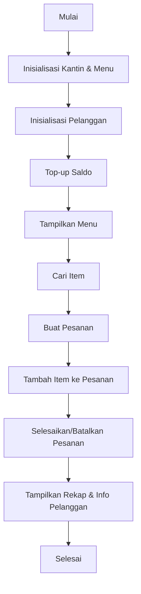

# Linus Code Log — 2026-04-13

[[Home]] | [[Linus Agent]]

---

## 16:18 · CODING
**Kamu:** jelaskan bagaimana code ini berkerja public class Main {
    public static void main(String[] args) {

        Kantin kantin = new Kantin("Kantin GerudaEats");
        MenuItem m1 = new MenuItem("Nasi Bakar", 15000, "Makanan", 10);
        MenuItem m2 = new MenuItem("Es Teh Manis", 5000, "Minuman", 20);
        MenuItem m3 = new MenuItem("Roti Bakar", 10000, "Makanan", 15);
        MenuItem m4 = new MenuItem("Kopi Hitam", 8000, "Minuman", 25);
        MenuItem m5 = new MenuItem("Mie Goreng", 12000, "Makanan", 12);
        MenuItem m6 = new MenuItem("Jus Jeruk", 7000, "Minuman", 18);
        kantin.tambahMenu(m1);
        kantin.tambahMenu(m2);
        kantin.tambahMenu(m3);
        kantin.tambahMenu(m4);
        kantin.tambahMenu(m5);
        kantin.tambahMenu(m6);

        Customer c1 = new Customer("Asep Salamanca", "102022530077");
        Customer c2 = new Customer("Teguh Van Hallen", "102022500384", 10000);

        c1.topUpSaldo(50000);

        System.out.println("\nMENU:");
        kantin.tampilkanMenuTersedia();

        System.out.println("\nCARI:");
        MenuItem cari = kantin.cariMenuByNama("Nasi Bakar");
        if (cari != null) cari.displayInfo();

        System.out.println("\nORDER 1:");
        Order o1 = kantin.buatOrder("ORD1", c1);
        o1.tambahItem(m1);
        o1.tambahItem(m2);
        kantin.selesaikanOrder(o1);
        o1.displayOrder();

        System.out.println("\nORDER 2:");
        Order o2 = kantin.buatOrder("ORD2", c2);
        o2.tambahItem(m1);
        o2.tambahItem(m2);
        kantin.selesaikanOrder(o2);
        o2.displayOrder();

        System.out.println("\nORDER 3:");
        Order o3 = kantin.buatOrder("ORD3", c1);
        o3.tambahItem(m3);
        o3.batalkanOrder();
        o3.displayOrder();

        System.out.println("\nREKAP:");
        kantin.tampilkanRekap();

        System.out.println("\nCUSTOMER:");
        c1.displayInfo();
        c2.displayInfo();
    }
}

**Coding:** **[Ini adalah program simulasi kantin sederhana yang mengelola menu, pelanggan, dan pesanan. Program ini menunjukkan bagaimana objek-objek berinteraksi dalam sistem: kantin menambah menu, pelanggan melakukan top-up saldo, membuat pesanan, dan kantin memproses pesanan tersebut.]**

---

### **Analogi Nyata**
Bayangkan ini seperti **kasir di kantin sekolah**:
1. **Kantin** punya daftar **menu** (nasi bakar, es teh, dll.) dengan stok.
2. **Pelanggan** (Asep, Teguh) punya **saldo** untuk membeli makanan.
3. Pelanggan **memesan** makanan → kantin **memproses** pesanan → stok berkurang, saldo pelanggan berkurang.
4. Jika pesanan **dibatalkan**, stok dan saldo dikembalikan.

---

### **Penjelasan Kode Baris per Baris**
#### **1. Inisialisasi Kantin dan Menu**
```java
Kantin kantin = new Kantin("Kantin GerudaEats");
MenuItem m1 = new MenuItem("Nasi Bakar", 15000, "Makanan", 10);
// ... (sampai m6)
kantin.tambahMenu(m1); // Tambahkan menu ke kantin
```
- **`Kantin`**: Kelas yang mengelola seluruh operasi kantin (menu, pesanan, rekap).
- **`MenuItem`**: Kelas untuk item menu (nama, harga, kategori, stok).
- **`kantin.tambahMenu()`**: Menyimpan semua item menu ke dalam daftar di kantin.

---

#### **2. Inisialisasi Pelanggan**
```java
Customer c1 = new Customer("Asep Salamanca", "102022530077");
Customer c2 = new Customer("Teguh Van Hallen", "102022500384", 10000);
c1.topUpSaldo(50000); // Asep menambah saldo Rp50.000
```
- **`Customer`**: Kelas untuk pelanggan (nama, NIM, saldo).
- **`topUpSaldo()`**: Menambah saldo pelanggan (Asep mulai dengan Rp50.000, Teguh Rp10.000).

---

#### **3. Menampilkan Menu dan Mencari Item**
```java
kantin.tampilkanMenuTersedia(); // Tampilkan semua menu yang stok > 0
MenuItem cari = kantin.cariMenuByNama("Nasi Bakar"); // Cari item "Nasi Bakar"
if (cari != null) cari.displayInfo(); // Tampilkan info item jika ditemukan
```
- **`tampilkanMenuTersedia()`**: Menampilkan menu yang stoknya masih ada.
- **`cariMenuByNama()`**: Mencari item menu berdasarkan nama (case-sensitive).

---

#### **4. Proses Pesanan (Order)**
##### **Order 1 (Asep)**
```java
Order o1 = kantin.buatOrder("ORD1", c1); // Buat pesanan baru untuk Asep
o1.tambahItem(m1); // Tambahkan Nasi Bakar ke pesanan
o1.tambahItem(m2); // Tambahkan Es Teh Manis
kantin.selesaikanOrder(o1); // Proses pesanan: kurangi stok, kurangi saldo Asep
o1.displayOrder(); // Tampilkan detail pesanan
```
- **`buatOrder()`**: Membuat objek `Order` baru dengan ID pesanan dan pelanggan.
- **`tambahItem()`**: Menambah item ke pesanan (jika stok cukup).
- **`selesaikanOrder()`**:
  - Cek apakah saldo pelanggan cukup.
  - Kurangi stok item yang dipesan.
  - Kurangi saldo pelanggan.
  - Tandai pesanan sebagai "Selesai".

##### **Order 2 (Teguh)**
```java
Order o2 = kantin.buatOrder("ORD2", c2);
o2.tambahItem(m1); // Nasi Bakar (stok berkurang lagi)
o2.tambahItem(m2); // Es Teh Manis
kantin.selesaikanOrder(o2); // Gagal jika saldo Teguh tidak cukup!
```
- Jika saldo **kurang**, pesanan akan **gagal** (tidak mengurangi stok/saldo).

##### **Order 3 (Asep - Dibatalkan)**
```java
Order o3 = kantin.buatOrder("ORD3", c1);
o3.tambahItem(m3); // Roti Bakar
o3.batalkanOrder(); // Batalkan pesanan: stok dan saldo dikembalikan
o3.displayOrder(); // Status pesanan berubah jadi "Dibatalkan"
```
- **`batalkanOrder()`**:
  - Kembalikan stok item yang dipesan.
  - Kembalikan saldo pelanggan.
  - Tandai pesanan sebagai "Dibatalkan".

---

#### **5. Rekap dan Info Pelanggan**
```java
kantin.tampilkanRekap(); // Tampilkan total pesanan, pendapatan, dll.
c1.displayInfo(); // Info Asep: nama, NIM, saldo tersisa
c2.displayInfo(); // Info Teguh: nama, NIM, saldo tersisa
```
- **`tampilkanRekap()`**: Menampilkan statistik kantin (total pesanan, pendapatan, dll.).
- **`displayInfo()`**: Menampilkan info pelanggan (nama, NIM, saldo).

---

### **Diagram Alur Program**


---

### **Hal yang Sering Salah Paham**
> 💡 **Common mistake**:
> - **Tidak menangani kasus saldo/stok tidak cukup**. Program ini *seharusnya* menampilkan pesan error jika saldo pelanggan kurang atau stok habis, tapi belum diimplementasikan.
> - **Case-sensitive pencarian**. Jika user mencari `"nasi bakar"` (huruf kecil), program tidak akan menemukannya karena pencarian `"Nasi Bakar"` (huruf besar).
> - **Tidak ada validasi duplikasi ID pesanan**. Jika `buatOrder()` dipanggil dengan ID yang sama, bisa menyebabkan bug.

> 🔥 **Pro tip**:
> - Tambahkan **exception handling** (try-catch) untuk menangani error seperti saldo kurang atau stok habis.
> - Gunakan **`equalsIgnoreCase()`** untuk pencarian menu agar tidak case-sensitive.
> - Simpan **log aktivitas** (misal: "Asep membatalkan pesanan ORD3") untuk debugging.

---

### **Next Step: Apa yang Harus Dipelajari Selanjutnya?**
1. **Error Handling**:
   Pelajari cara menggunakan `try-catch` di Java untuk menangani kesalahan (contoh: saldo kurang, stok habis).
   **Referensi**: [Java Exception Handling (Oracle Docs)](https://docs.oracle.com/javase/tutorial/essential/exceptions/)

2. **Konsep OOP Lebih Dalam**:
   - **Encapsulation**: Pastikan atribut kelas (seperti `saldo` di `Customer`) tidak bisa diakses langsung dari luar kelas.
   - **Inheritance**: Buat kelas turunan seperti `PremiumCustomer` yang punya diskon.
   - **Polymorphism**: Override method `displayInfo()` untuk kelas turunan.

3. **Implementasi Fitur Baru**:
   - **Diskon**: Tambahkan diskon untuk pelanggan tertentu.
   - **Antrian Pesanan**: Gunakan `Queue` untuk mengelola pesanan yang menunggu diproses.
   - **Database**: Simpan data menu/pelanggan ke file (CSV) atau database (SQLite).

---
**Ingin saya jelaskan bagian spesifik lebih detail?** Misal:
- Bagaimana cara kerja method `selesaikanOrder()` di kelas `Kantin`?
- Bagaimana implementasi kelas `MenuItem` atau `Customer`?
- Atau ingin saya tambahkan fitur baru (misal: diskon, antrian)?

---