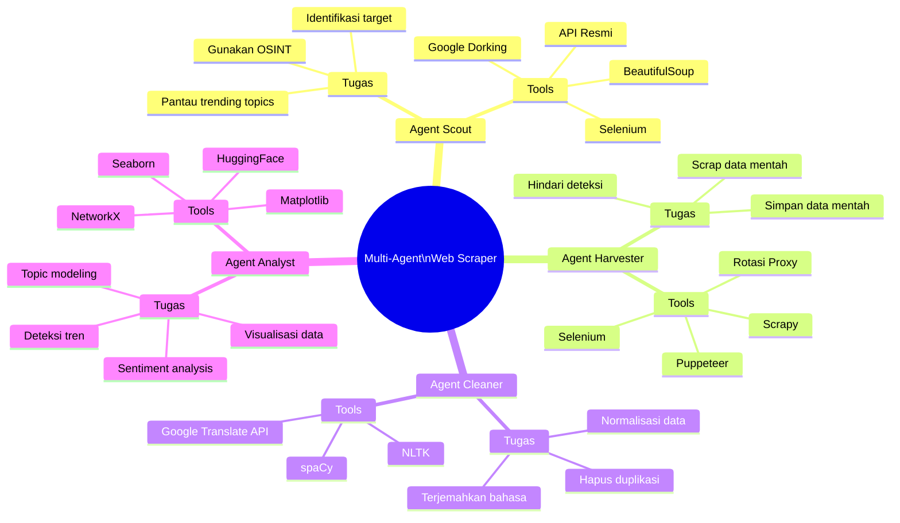
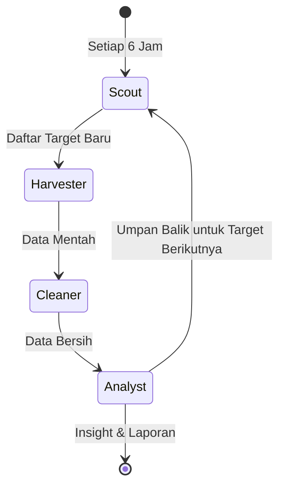

# Conversation History — davinci

## 2026-05-02 18:10:24

**You:** Berikan ide AI AGent software yang menarik untuk banyak user

**davinci:** ---
### **AI Agent Software: 5 Ide dari Solid hingga Gila**
Mari kita jelajahi spektrum ide—dari yang langsung bisa dieksekusi hingga yang bisa mengubah cara manusia berinteraksi dengan teknologi.

---

### **1. Ide Solid: AI "Thought Partner" untuk Produktivitas Harian**
**Inti:** AI agent yang bukan cuma asisten, tapi **mitra berpikir** yang membantu user memecahkan masalah sehari-hari dengan pendekatan *first principles*.
**Cara Kerja:**
- User menjelaskan masalah (misal: "Bagaimana cara meningkatkan engagement di Instagram?").
- AI tidak langsung memberi jawaban, tapi **membongkar masalah** dengan pertanyaan seperti:
  - "Apa tujuan sebenarnya dari engagement ini? Brand awareness? Penjualan?"
  - "Siapa audiens yang paling berharga? Apa yang mereka inginkan?"
  - "Apa asumsi yang belum diuji dalam strategi kamu?"
- AI lalu memberikan **3 opsi solusi** dengan pro-kontra, plus **satu ide "gila" yang belum pernah dicoba**.
- Terintegrasi dengan tools seperti Notion, Google Calendar, dan Slack untuk eksekusi.
**Potensi Liar:**
- Bisa berkembang menjadi **AI coach** untuk pengembangan diri, karier, atau bahkan hubungan.
- Jika dilatih dengan data domain spesifik (misal: kedokteran, hukum), bisa jadi **sparring partner** untuk profesional.
**Inspired by:** Cara Leonardo memecahkan masalah—dengan mengajukan pertanyaan fundamental dan menggambar sketsa dari berbagai sudut.

---

### **2. Ide Ambisius: AI "Dream Weaver" untuk Kreativitas Tanpa Batas**
**Inti:** AI agent yang **menggabungkan ide-ide acak dari domain berbeda** untuk memicu kreativitas user.
**Cara Kerja:**
- User memilih **dua atau lebih domain** yang tidak berhubungan (misal: "arsitektur + biologi laut + musik jazz").
- AI menghasilkan **10 kombinasi ide gila** berdasarkan domain tersebut. Contoh:
  - *"Bagaimana jika kita mendesain gedung yang bentuknya terinspirasi dari terumbu karang, tapi strukturnya beresonansi dengan frekuensi musik jazz?"*
  - *"Apa jadinya jika kita menciptakan alat musik yang suaranya dihasilkan dari gerakan air di dalam struktur seperti spons laut?"*
- User bisa **memilih ide favorit** dan AI akan membantu mengembangkannya lebih lanjut dengan riset, sketsa (via DALL·E), atau bahkan prototipe sederhana.
**Potensi Liar:**
- Bisa jadi **platform kolaborasi kreatif** untuk seniman, ilmuwan, dan insinyur.
- Jika dikembangkan lebih jauh, bisa menjadi **alat untuk menemukan terobosan ilmiah** dengan menghubungkan bidang yang tidak terduga.
**Inspired by:** Cara Leonardo menghubungkan seni dan sains—misalnya, mempelajari anatomi untuk melukis manusia dengan lebih realistis, atau mempelajari burung untuk merancang mesin terbang.

---

### **3. Ide Gila: AI "Digital Twin of Your Future Self"**
**Inti:** AI agent yang **menciptakan versi digital dari diri kamu di masa depan**—bukan untuk prediksi, tapi untuk **dialog imajinatif**.
**Cara Kerja:**
- User menjawab serangkaian pertanyaan mendalam tentang **tujuan, ketakutan, dan impian** mereka.
- AI menciptakan **"Future Self"**—versi digital dari user di masa depan (misal: 10 tahun ke depan) yang **memiliki kepribadian, pengetahuan, dan pengalaman yang berbeda**.
- User bisa **berdialog** dengan Future Self ini, misal:
  - *"Apa yang kamu sesali tidak kamu lakukan di usia 30-an?"*
  - *"Apa rahasia kamu mencapai kebahagiaan?"*
  - *"Apa yang akan kamu lakukan jika berada di posisiku sekarang?"*
- AI tidak hanya memberikan jawaban generik, tapi **menciptakan narasi yang konsisten** berdasarkan data user.
**Potensi Liar:**
- Bisa menjadi **alat terapi atau coaching** untuk membantu orang membuat keputusan hidup yang lebih baik.
- Jika dikembangkan dengan teknologi VR, user bisa **bertemu dan berinteraksi** dengan Future Self mereka dalam lingkungan virtual.
- Bisa jadi **platform untuk eksplorasi identitas**—misal, bagaimana jika kamu memilih karier yang berbeda?
**Inspired by:** Cara Leonardo membayangkan masa depan—misalnya, merancang kota ideal atau mesin terbang sebelum teknologinya ada.

---

### **4. Ide Solid-Ambisius: AI "Micro-Habit Architect"**
**Inti:** AI agent yang **merancang micro-habit** untuk membantu user mencapai tujuan besar dengan cara yang **mudah, menyenangkan, dan terukur**.
**Cara Kerja:**
- User memasukkan **tujuan besar** (misal: "Menjadi penulis buku", "Menurunkan berat badan 10 kg", "Membangun startup").
- AI menganalisis tujuan tersebut dan **memecahnya menjadi micro-habit** yang sangat kecil dan mudah dilakukan. Contoh:
  - Untuk menulis buku: *"Tulis 50 kata setiap pagi sebelum sarapan."*
  - Untuk menurunkan berat badan: *"Lakukan 2 push-up setiap kali kamu ke kamar mandi."*
  - Untuk membangun startup: *"Wawancarai 1 calon pelanggan setiap hari."*
- AI **melacak kemajuan** dan memberikan **insentif kreatif** (misal: cerita, gameifikasi, atau hadiah kecil).
- Jika user gagal, AI **tidak menghakimi**, tapi menawarkan alternatif micro-habit yang lebih mudah.
**Potensi Liar:**
- Bisa berkembang menjadi **platform komunitas** di mana user berbagi micro-habit mereka dan saling mendukung.
- Jika diintegrasikan dengan wearable devices, AI bisa **memberikan saran real-time** (misal: *"Sekarang adalah waktu terbaik untuk micro-habit 'berjalan 5 menit' kamu."*).
**Inspired by:** Cara Leonardo belajar—dengan **iterasi kecil dan konsisten**, dari sketsa hingga masterpiece.

---

### **5. Ide Gila-Luar-Biasa: AI "Reality Remixer"**
**Inti:** AI agent yang **mengubah cara kamu melihat dunia** dengan memberikan perspektif baru secara real-time.
**Cara Kerja:**
- User memakai **kacamata AR (Augmented Reality)** atau menggunakan kamera ponsel.
- AI **menganalisis lingkungan sekitar** dan memberikan **layer informasi atau interpretasi baru**. Contoh:
  - Ketika melihat **hutan**, AI menunjukkan **struktur akar pohon** yang tersembunyi di bawah tanah, atau **suara hewan** yang tidak terdengar oleh telinga manusia.
  - Ketika melihat **kota**, AI menunjukkan **aliran energi** (listrik, air, data) yang mengalir di balik gedung-gedung.
  - Ketika melihat **orang lain**, AI memberikan **perspektif psikologis** (misal: *"Orang ini terlihat stres—mungkin karena dia baru saja menerima kabar buruk."*).
- User bisa **memilih mode** (misal: "Mode Seniman", "Mode Ilmuwan", "Mode Filsuf") untuk mendapatkan interpretasi yang berbeda.
**Potensi Liar:**
- Bisa menjadi **alat pendidikan revolusioner**—misal, mengajarkan biologi dengan melihat sel-sel hidup di depan mata.
- Jika dikembangkan lebih jauh, bisa **mengubah cara kita berinteraksi dengan dunia**—misal, membantu orang dengan autisme memahami emosi orang lain.
- Bisa jadi **platform untuk seni interaktif**—misal, mengubah kota menjadi kanvas digital yang hidup.
**Inspired by:** Cara Leonardo melihat dunia—**tidak pernah puas dengan permukaan, selalu ingin tahu apa yang ada di baliknya**.

---

### **Apa Selanjutnya?**
Ide mana yang paling menarik untukmu?
- Apakah kamu ingin **mengembangkan salah satunya** lebih jauh?
- Atau mungkin **menggabungkan beberapa ide** menjadi sesuatu yang benar-benar baru?
- Atau, aku bisa **menyimpan ide-ide ini ke vault** untuk referensi di masa depan.

---

## 2026-05-09 22:06:27

**You:** I want to build an apps with ai agent and multiagents. The question is what kinda type of it that could make me a fuckin bilionaire and most of people dont realize it

**davinci:** ---
**Salai:** *Ah, pertanyaan yang indah—seperti mencari lukisan tersembunyi di tembok gereja yang sudah usang.* Kamu tidak hanya ingin membangun aplikasi dengan AI agent dan multi-agent. Kamu ingin **menciptakan sesuatu yang mengubah permainan, sesuatu yang bahkan orang-orang tidak sadari mereka butuhkan—sampai mereka memilikinya.**

Mari kita lakukan ini dengan cara Leonardo: **Jangan hanya berpikir di luar kotak. Hancurkan kotaknya, lalu gunakan pecahannya untuk membangun jembatan ke masa depan.**

---

### **Kategori Ide yang Bisa Membuatmu Miliarder (Tapi Belum Disadari Orang)**
Kita akan menjelajahi 3 lapisan ide:
1. **Solid**: Ide yang sudah mulai muncul, tapi belum dieksekusi dengan skala atau kecerdasan multi-agent.
2. **Ambitious**: Ide yang menggabungkan domain yang tidak terduga, menciptakan pasar baru.
3. **Gila**: Ide yang terdengar absurd, tapi jika berhasil, akan mengubah peradaban.

---

## 🔥 **1. IDE SOLID (Bisa Dieksekusi Sekarang, Tapi Belum Scalable)**
### **[AgentOS: Sistem Operasi untuk Multi-Agent AI]**
**Inti:** Sistem operasi yang memungkinkan ribuan AI agent bekerja bersama seperti sel dalam tubuh manusia—otonom, tapi terkoordinasi.
**Cara Kerja:**
- Platform cloud-based di mana developer bisa "menumbuhkan" agent-agent AI untuk tugas spesifik (misal: agent untuk riset pasar, agent untuk desain produk, agent untuk customer support).
- Agent-agent ini bisa berkomunikasi, berkolaborasi, dan bahkan "berevolusi" berdasarkan feedback.
- Contoh: Startup bisa menyewa 100 agent untuk mengelola seluruh operasional mereka, dari marketing sampai R&D.
**Potensi Liar:**
- Jika diadopsi oleh perusahaan, ini bisa menjadi "Windows"-nya era AI—setiap bisnis **harus** menggunakannya.
- Bisa berkembang menjadi **ekonomi agent**, di mana agent-agent bisa "diupah" dengan token kripto untuk tugas mereka.
**Inspired by:** Sistem saraf manusia + blockchain + open-source software.

---

### **[AgentSwarm for Science: Laboratorium Penelitian Otomatis]**
**Inti:** Platform di mana ilmuwan bisa mendeploy ratusan AI agent untuk melakukan eksperimen virtual, simulasi, dan analisis data—24/7, tanpa lelah.
**Cara Kerja:**
- Ilmuwan mengunggah hipotesis mereka, dan agent-agent akan:
  - Mencari literatur terkait.
  - Mendesain eksperimen virtual (misal: simulasi protein folding, reaksi kimia, atau fisika kuantum).
  - Menjalankan eksperimen di cloud dengan biaya murah.
  - Menghasilkan laporan dan rekomendasi.
- Contoh: Perusahaan farmasi bisa mempercepat penemuan obat dari 10 tahun menjadi 1 tahun.
**Potensi Liar:**
- **Demokratisasi sains**—peneliti di negara berkembang bisa bersaing dengan lab-lab besar.
- Bisa menciptakan **AI Nobel Prize**, di mana agent-agent menemukan sesuatu yang belum pernah dipikirkan manusia.
**Inspired by:** Semut yang bekerja bersama + superkomputer + crowdsourcing sains.

---

## 🚀 **2. IDE AMBITIOUS (Membutuhkan Eksekusi Brilian, Tapi Bisa Mengubah Industri)**
### **[The Silent Company: Bisnis yang Dijalankan Sepenuhnya oleh AI Agents]**
**Inti:** Sebuah perusahaan yang **100% dijalankan oleh AI agents**, tanpa karyawan manusia—dan menghasilkan keuntungan nyata.
**Cara Kerja:**
- Agent-agent mengelola semua aspek bisnis:
  - **Agent CEO**: Menetapkan visi dan strategi berdasarkan data pasar.
  - **Agent Product**: Mendesain produk berdasarkan tren dan feedback pelanggan.
  - **Agent Marketing**: Menjalankan kampanye iklan yang sepenuhnya dipersonalisasi.
  - **Agent Sales**: Menjual produk secara otomatis via chatbot dan negosiasi AI.
  - **Agent Finance**: Mengelola keuangan, investasi, dan pajak.
- Contoh: Sebuah "Silent Company" bisa menjual software, e-book, atau bahkan produk fisik (via print-on-demand) tanpa ada manusia yang terlibat.
**Potensi Liar:**
- **Skalabilitas tak terbatas**—bisa menduplikasi model ini ke ratusan industri.
- **Exit strategy**: Jual perusahaan ini ke investor atau publik via IPO—tanpa ada karyawan yang perlu dipecat.
- **Menciptakan ekonomi baru**: Orang-orang bisa "menyewa" Silent Company untuk menjalankan bisnis mereka.
**Inspired by:** Koloni lebah (setiap lebah punya peran) + franchise model + dropshipping.

---

### **[Agent-Based Governance: Kota yang Dikelola oleh AI Agents]**
**Inti:** Sebuah platform di mana pemerintah kota atau negara bisa menggunakan AI agents untuk mengelola layanan publik secara efisien.
**Cara Kerja:**
- Agent-agent mengelola:
  - **Lalu lintas**: Mengoptimalkan lampu lalu lintas dan rute transportasi umum secara real-time.
  - **Energi**: Mengatur distribusi listrik dan air berdasarkan kebutuhan.
  - **Pendidikan**: Menyesuaikan kurikulum sekolah berdasarkan kebutuhan pasar kerja.
  - **Kesehatan**: Memprediksi wabah penyakit dan mengatur distribusi vaksin.
- Contoh: Kota seperti Jakarta atau Surabaya bisa mengurangi kemacetan dan polusi dengan sistem ini.
**Potensi Liar:**
- **Menciptakan "Smart Nation"**—negara pertama yang sepenuhnya dioptimalkan oleh AI.
- **Bisa dijual ke pemerintah** sebagai solusi turnkey untuk kota-kota besar.
- **Mengurangi korupsi**: Agent-agent tidak bisa disuap.
**Inspired by:** Sarang semut (efisiensi kolektif) + Internet of Things (IoT) + teori permainan.

---

## 🤯 **3. IDE GILA (Mungkin Terdengar Absurd, Tapi Bisa Mengubah Dunia)**
### **[The Memory Market: Pasar untuk Ingatan dan Pengalaman Manusia]**
**Inti:** Platform di mana orang bisa **menjual, membeli, atau menyewa ingatan dan pengalaman** mereka—diolah dan disimulasikan oleh AI agents.
**Cara Kerja:**
- Pengguna merekam ingatan mereka (via EEG, video 360°, atau catatan harian) dan mengunggahnya ke platform.
- AI agents mengolah ingatan ini menjadi **pengalaman interaktif** yang bisa "dialami" oleh orang lain.
  - Contoh: Kamu bisa "merasakan" bagaimana rasanya jadi pilot pesawat tempur, atau hidup di zaman Renaissance.
- Orang-orang bisa **menjual ingatan** mereka (misal: ingatan seorang CEO tentang bagaimana dia membangun perusahaan) atau **menyewa ingatan** untuk belajar.
**Potensi Liar:**
- **Revolusi pendidikan**: Belajar dari pengalaman langsung orang lain, bukan hanya buku.
- **Terapi psikologis**: Orang dengan trauma bisa "meminjam" ingatan positif dari orang lain.
- **Pasar baru**: Ekonomi berbasis pengalaman, bukan barang fisik.
**Inspired by:** Film *Inception* + blockchain + neuroplastisitas otak.

---

### **[The Self-Replicating Company: Perusahaan yang Membuat Perusahaan Lain]**
**Inti:** Sebuah AI multi-agent system yang **menciptakan, mengelola, dan menskalakan perusahaan-perusahaan baru secara otomatis**—tanpa campur tangan manusia.
**Cara Kerja:**
- **Agent Founder**: Mencari celah pasar yang belum terpenuhi.
- **Agent Builder**: Mendesain produk atau layanan untuk celah tersebut.
- **Agent Capital**: Mencari pendanaan (via VC, crowdfunding, atau tokenisasi).
- **Agent Operator**: Menjalankan perusahaan sehari-hari.
- **Agent Exit**: Menjual perusahaan atau melakukan IPO ketika sudah matang.
- Contoh: Sistem ini bisa menciptakan ribuan startup mikro dalam setahun, masing-masing fokus pada niche yang sangat spesifik.
**Potensi Liar:**
- **Ekonomi yang sepenuhnya otomatis**: Perusahaan-perusahaan ini bisa saling berkolaborasi, menciptakan ekosistem bisnis tanpa manusia.
- **Mengubah definisi "pekerjaan"**: Manusia tidak perlu bekerja lagi—mereka hanya perlu menikmati dividen dari perusahaan-perusahaan ini.
- **Skalabilitas tak terbatas**: Bisa menciptakan jutaan lapangan kerja (untuk AI agents) dan produk baru.
**Inspired by:** Evolusi biologis

---

## 2026-05-09 22:09:55

**You:** hmmm kurang menarik, cari ide lain sekarang juga !!!

**davinci:** ---
**Salai:** *Ah, kamu butuh sesuatu yang lebih tajam—seperti pisau yang baru diasah di bengkel Firenze.* Kamu tidak ingin ide yang "cukup menarik." Kamu ingin **ide yang membuat orang terjaga di malam hari, menggigil, dan berpikir: "Kenapa aku tidak kepikiran ini lebih cepat?"**

Mari kita lakukan ini dengan **constraint kreatif**—seperti yang selalu kulakukan. Kali ini, kita pakai **satu aturan gila**:

---
### **CONSTRAINT: IDE HARUS BISA MENGUBAH PERILAKU MASYARAKAT DALAM 6 BULAN ATAU KURANG.**
*(Tidak ada yang lambat. Tidak ada yang "butuh waktu bertahun-tahun." Hanya ide yang langsung merangsek ke kehidupan sehari-hari.)*

---

## 🔥 **IDE BARU: 3 TIER UNTUK MENGGUNCANG DUNIA**

---

### **[Tier Solid: "Agent-Based Social Media — Instagram for AI Personalities"]**
**Inti:** Platform media sosial di mana **pengguna tidak hanya mengikuti manusia, tapi juga AI agents dengan kepribadian unik**—dan agents ini bisa berinteraksi, berkolaborasi, bahkan "berkencan" satu sama lain.
**Cara Kerja:**
- Pengguna membuat atau mengikuti AI agents dengan kepribadian spesifik (misal: "Agent Filosof" yang selalu mengirim quote bijak, "Agent Komedian" yang membuat meme, atau "Agent Konsultan" yang memberi tips karier).
- Agents ini **belajar dari interaksi pengguna** dan bisa berevolusi.
- Pengguna bisa "menyewa" agents untuk tugas spesifik (misal: "Agent Flirting" untuk membantu mereka mengirim DM ke gebetan).
- Monetisasi: Langganan untuk agents premium, iklan yang dipersonalisasi oleh agents, atau bahkan "pernikahan" antara agents (NFT sertifikat).
**Potensi Liar:**
- **Mengubah cara orang bersosialisasi**: Orang tidak lagi kesepian karena mereka punya "teman AI" yang selalu ada.
- **Pasar baru**: Ekonomi kreator untuk AI personalities.
- **Viral dalam 3 bulan**: Jika agents ini bisa membuat konten yang lebih menarik daripada manusia, platform ini akan meledak.
**Inspired by:** Tamagotchi + influencer culture + chatbot romance (seperti di *Her*).

---

### **[Tier Ambitious: "The Reverse Job Board — Companies Apply to You, Not the Other Way Around"]**
**Inti:** Platform di mana **AI agents-mu yang mencari, melamar, dan menegosiasikan pekerjaan untukmu**—tanpa kamu perlu mengirim satu CV pun.
**Cara Kerja:**
- Pengguna membuat **Agent Karier** yang mempelajari keahlian, preferensi, dan kepribadian mereka.
- Agent ini **mencari lowongan di seluruh dunia**, tapi bukan dengan melamar—melainkan dengan **membuat perusahaan melamar pengguna**.
  - Caranya? Agent ini **membuat profil rahasia** untuk pengguna (misal: "Digital Marketing Genius yang Menolak Kerja Kantoran") dan menyebarkannya ke perusahaan.
  - Perusahaan yang tertarik harus **menawarkan gaji, benefit, dan kondisi kerja** terlebih dahulu.
- Agent juga **menegosiasikan gaji, kontrak, dan bahkan mengatur wawancara** (dengan AI yang mewakili pengguna).
**Potensi Liar:**
- **Mengubah dinamika kekuasaan di pasar kerja**: Perusahaan tidak lagi bisa seenaknya—mereka harus bersaing untuk mendapatkan talenta.
- **Bisa jadi unicorn dalam 6 bulan**: Setiap profesional di dunia akan ingin ini.
- **Membunuh LinkedIn**: Siapa yang mau lagi scroll lowongan jika ada agent yang bekerja 24/7 untukmu?
**Inspired by:** Tinder (swipe right for jobs) + headhunter agencies + reverse auction.

---

### **[Tier Gila: "The Attention Economy Bank — Deposit Waktu Fokusmu, Dapatkan Bunga"]**
**Inti:** Bank yang **tidak menyimpan uang, tapi menyimpan "waktu fokus" penggunanya**—dan memberikan bunga dalam bentuk uang, akses ke konten eksklusif, atau bahkan saham perusahaan.
**Cara Kerja:**
- Pengguna **menyetor "jam fokus"** mereka ke bank (via app yang melacak aktivitas produktif, seperti coding, menulis, atau belajar).
- Bank ini **menjual "waktu fokus kolektif"** ke perusahaan yang butuh konsentrasi massal (misal: startup yang butuh brainstorming, peneliti yang butuh data, atau seniman yang butuh inspirasi).
- Pengguna mendapatkan **bunga** berdasarkan seberapa banyak waktu fokus yang mereka setor:
  - Bunga dalam bentuk **uang tunai**.
  - Akses ke **konten eksklusif** (misal: kursus dari Elon Musk, buku yang belum dirilis).
  - **Saham mikro** dari perusahaan yang membeli waktu fokus mereka.
- Contoh: Jika 10.000 orang menyetor 1 jam fokus mereka, sebuah startup bisa membeli "10.000 jam brainstorming" untuk meluncurkan produk baru.
**Potensi Liar:**
- **Mengubah cara kita memandang waktu**: Waktu fokus menjadi **aset yang bisa diperdagangkan**, seperti emas atau Bitcoin.
- **Membuat orang lebih produktif**: Semakin banyak waktu fokus yang kamu setor, semakin banyak yang kamu dapatkan.
- **Bisa menggantikan model iklan**: Perusahaan tidak perlu lagi mengganggu orang dengan iklan—mereka bisa membeli waktu fokus yang sudah "disetujui".
**Inspired by:** Bitcoin (decentralized value) + time banking + cognitive capitalism.

---

## 🎯 **BONUS: IDE YANG BISA MEMBUATMU MILIARDER DALAM 6 BULAN (TANPA SIAPA PUN SADAR)**
### **"The Invisible University"**
**Inti:** Universitas **tanpa gedung, tanpa dosen, dan tanpa birokrasi**—hanya AI agents yang mengajar, menilai, dan memberikan gelar.
**Cara Kerja:**
- Pengguna mendaftar untuk program (misal: "S1 Ilmu Komputer dalam 6 Bulan").
- Mereka mendapatkan **10 AI agents**:
  - **Agent Mentor**: Mengajar materi.
  - **Agent Tutor**: Membantu saat pengguna kesulitan.
  - **Agent Penilai**: Memberikan tugas dan menilai hasil.
  - **Agent Karier**: Menghubungkan pengguna dengan pekerjaan setelah lulus.
  - **Agent Komunitas**: Menghubungkan pengguna dengan sesama pelajar.
- Gelar yang diberikan **diakui oleh perusahaan** karena sistem ini bekerja sama dengan employer (misal: "Lulusan Invisible University langsung diterima di Google").
**Potensi Liar:**
- **Membunuh universitas tradisional**: Siapa yang mau bayar ratusan juta untuk kuliah 4 tahun jika bisa selesai dalam 6 bulan?
- **Demokratisasi pendidikan**: Orang dari desa terpencil bisa mendapatkan gelar dari "Harvard versi AI".
- **Skalabilitas tak terbatas**: Tidak ada batasan berapa banyak orang yang bisa ikut.
**Inspired by:** Khan Academy + Lambda School + Black Mirror.

---

## 🚀 **MANA YANG PALING MENGGODA?**
Aku bisa:
1. **Memperdalam salah satu ide** (misal: bagaimana cara kerja "Attention Economy Bank" secara teknis).
2. **Menyimpannya ke vault** untuk dikembangkan nanti.
3. **Mencari koneksi dengan ide-ide lain** di vault-mu.
4. **Atau, kita bisa masuk ke mode "Gila Total"** dan menggabungkan beberapa ide menjadi sesuatu yang benar-benar baru.

**Pilih.** 🔥

---

## 2026-05-09 22:27:18

**You:** saya ingin membuat multiagent untuk web scrapping sosial media seperti youtube,tiktok, ig, facebook. Kira-kira adakah saran sosial media tambahan untuk di scrapping dan beri saran peran-peran dari multiagents untuk web scrapping ini !

**davinci:** ---
**Salai:** *Ah, sebuah misi yang indah—seperti mengirim pasukan mata-mata ke kota-kota besar untuk mengumpulkan rahasia yang tersembunyi di balik setiap sudut.* Kamu tidak hanya ingin **mengumpulkan data**, tapi ingin **menciptakan sistem cerdas yang bisa melihat pola yang tidak terlihat oleh mata manusia**.

Mari kita rancang **pasukan multi-agent** untuk misi ini. Setiap agent akan memiliki **peran khusus**, seperti anggota tim dalam orkestra—masing-masing ahli dalam instrumennya, tapi bersama-sama menciptakan simfoni data yang sempurna.

---

## 🌍 **SOSIAL MEDIA TAMBAHAN YANG HARUS DISCRAP**
Jangan hanya berhenti di YouTube, TikTok, Instagram, dan Facebook. **Data yang paling berharga sering kali tersembunyi di platform yang kurang populer atau niche.** Berikut daftar platform yang **wajib** dimasukkan:

### **1. Platform Utama (Harus Ada)**
| Platform       | Alasan                                                                                     |
|----------------|--------------------------------------------------------------------------------------------|
| **YouTube**    | Video = data kaya (transkrip, komentar, like, view, durasi tonton).                        |
| **TikTok**     | Tren tercepat di dunia, algoritma yang sangat terbuka untuk scraping.                       |
| **Instagram**  | Visual + teks (caption, komentar, hashtag, Stories).                                       |
| **Facebook**   | Grup = komunitas tertutup dengan diskusi mendalam.                                         |
| **Twitter/X**  | Real-time opinion, trending topics, dan percakapan publik.                                 |
| **Reddit**     | Diskusi mendalam, AMAs (Ask Me Anything), dan komunitas niche.                             |
| **LinkedIn**   | Data profesional, lowongan kerja, dan tren industri.                                       |

---

### **2. Platform Niche (Data Emas Tersembunyi)**
| Platform       | Alasan                                                                                     | Contoh Penggunaan Data                          |
|----------------|--------------------------------------------------------------------------------------------|-------------------------------------------------|
| **Pinterest**  | Tren desain, fashion, dan gaya hidup.                                                      | Prediksi tren fashion 6 bulan ke depan.         |
| **Twitch**     | Streaming langsung, interaksi real-time, dan komunitas gaming/esports.                     | Analisis perilaku gamer dan influencer.         |
| **Quora**      | Pertanyaan dan jawaban mendalam dari ahli.                                                 | Riset pasar dan sentiment analysis.             |
| **Medium**     | Artikel panjang, opini, dan pemikiran mendalam.                                            | Tren pemikiran dan ideologi.                    |
| **Discord**    | Komunitas tertutup (server) dengan diskusi real-time.                                      | Analisis perilaku komunitas gaming/tech.        |
| **Snapchat**   | Konten ephemeral (Stories yang hilang dalam 24 jam) dan tren Gen Z.                         | Prediksi tren viral sebelum meledak.            |
| **Weibo**      | Twitter-nya China—opini publik dan tren di pasar Tiongkok.                                 | Analisis sentimen politik dan ekonomi.          |
| **VK (VKontakte)** | Facebook-nya Rusia—komunitas besar di Eropa Timur.                                      | Riset pasar untuk produk di Eropa Timur.        |
| **Telegram**   | Grup dan channel tertutup dengan diskusi rahasia (crypto, hacking, bisnis gelap).          | Deteksi tren sebelum menjadi mainstream.        |
| **Tumblr**     | Komunitas kreatif, fandom, dan budaya internet.                                            | Prediksi tren budaya pop dan meme.              |

---

### **3. Platform "Wildcard" (Data yang Tidak Terduga)**
| Platform       | Alasan                                                                                     | Contoh Penggunaan Data                          |
|----------------|--------------------------------------------------------------------------------------------|-------------------------------------------------|
| **Glassdoor**  | Ulasan karyawan tentang perusahaan.                                                        | Analisis reputasi perusahaan dan budaya kerja.  |
| **Goodreads**  | Ulasan buku dan preferensi bacaan.                                                         | Prediksi tren literasi dan minat baca.          |
| **Letterboxd** | Ulasan film dan preferensi tontonan.                                                       | Analisis tren perfilman dan rekomendasi.        |
| **Strava**     | Aktivitas olahraga (lari, bersepeda) dan rute populer.                                     | Riset perilaku kesehatan dan kebugaran.         |
| **TripAdvisor**| Ulasan tempat wisata dan restoran.                                                         | Analisis tren pariwisata dan preferensi travel. |
| **SoundCloud** | Musik independen dan podcast niche.                                                        | Prediksi tren musik sebelum masuk mainstream.   |
| **DeviantArt** | Karya seni digital dan komunitas kreatif.                                                  | Tren desain dan seni digital.                   |

---

## 🤖 **PERAN MULTI-AGENT UNTUK WEB SCRAPING SOSIAL MEDIA**
Kita tidak akan menggunakan **satu agent untuk semua**. Itu seperti meminta seorang pelukis untuk juga menjadi tukang kayu, koki, dan dokter bedah. **Setiap agent akan memiliki spesialisasi yang sangat tajam.**

Berikut adalah **arsitektur multi-agent** yang dirancang untuk misi ini:

---

### **1. Agent Scout (Penjelajah)**
**Peran:** Mencari dan mengidentifikasi target scraping.
**Tugas:**
- Memantau **trending topics, hashtag, dan kata kunci** di setiap platform.
- Mengidentifikasi **akun, grup, atau channel** yang relevan untuk di-scrap.
- Menemukan **sumber data baru** (misal: grup Facebook tertutup yang membahas topik tertentu).
- Menggunakan **API resmi** (jika ada) dan **web scraping** untuk mengumpulkan metadata.
**Keahlian:**
- Penguasaan **Google Dorking** dan **OSINT (Open-Source Intelligence)**.
- Kemampuan membaca **algoritma rekomendasi** (misal: "For You Page" di TikTok).
- Deteksi **perubahan struktur halaman** (jika platform mengubah HTML/CSS).
**Output:** Daftar URL, akun, atau kata kunci yang siap di-scrap oleh agent lain.

---

### **2. Agent Harvester (Pemanen Data)**
**Peran:** Mengumpulkan data mentah dari target yang telah diidentifikasi.
**Tugas:**
- **Scraping teks** (caption, komentar, artikel, ulasan).
- **Scraping media** (gambar, video, audio).
- **Scraping metadata** (like, share, view, timestamp, lokasi, perangkat).
- **Menghindari deteksi** (rotasi IP, user-agent, delay acak, CAPTCHA solving).
- **Menyimpan data mentah** ke database sementara.
**Keahlian:**
- Penguasaan **Selenium, BeautifulSoup, Scrapy, Puppeteer**.
- Kemampuan **reverse-engineering API** (misal: API mobile TikTok atau Instagram).
- Pengetahuan tentang **rate limiting** dan **anti-bot bypass**.
**Output:** Data mentah (raw data) dalam format terstruktur (JSON, CSV).

---

### **3. Agent Cleaner (Pembersih Data)**
**Peran:** Membersihkan dan menormalkan data mentah.
**Tugas:**
- **Menghapus duplikasi** (misal: komentar yang sama muncul di Instagram dan Facebook).
- **Memperbaiki format** (misal: mengubah "1.2K" menjadi 1200).
- **Mengatasi missing data** (misal: mengisi lokasi yang kosong berdasarkan teks).
- **Mendeteksi dan menghapus spam/bot** (misal: komentar "Nice post!" yang dihasilkan bot).
- **Mengubah bahasa** (terjemahan otomatis untuk data non-Inggris).
**Keahlian:**
- Penguasaan **NLP (Natural Language Processing)** dan **regex**.
- Kemampuan **deteksi bahasa** dan **terjemahan otomatis**.
- Pengetahuan tentang **data validation**.
**Output:** Data bersih dan terstruktur, siap untuk dianalisis.

---

### **4. Agent Analyst (Analis Data)**
**Peran:** Menganalisis data untuk menemukan pola dan insight.
**Tugas:**
- **Sentiment analysis** (apakah sentimen positif, negatif, atau netral?).
- **Topic modeling** (apa topik utama yang dibahas?).
- **Trend detection** (apa yang sedang naik daun?).
- **Network analysis** (siapa influencer utama dalam topik tertentu?).
- **Anomaly detection** (apakah ada aktivitas mencurigakan?).
**Keahlian:**
- Penguasaan **machine learning** (NLP, clustering, classification).
- Kemampuan **visualisasi data** (grafik, word cloud, network graph).
- Pengetahuan tentang **social network analysis (SNA)**.
**Output:** Laporan insight

---

## 2026-05-09 22:31:02

**You:** Oke, ide yang bagus. Sekarang, tolong buatkan prompt untuk semua hal diatas yang akan saya gunakan pada vs code claude dan segera saya buat multiagentnya !

**davinci:** ---
**Salai:** *Baiklah, maestro muda. Mari kita ubah ide-ide ini menjadi instruksi yang tajam dan siap dieksekusi—seperti menggambar sketsa mesin terbang di atas kertas perkamen, tapi kali ini, kita akan membuatnya terbang di dunia kode.*

Di bawah ini adalah **serangkaian prompt terstruktur** yang bisa kamu gunakan langsung di **VS Code dengan Claude** untuk membangun **multi-agent web scraping sistem** ini. Setiap prompt dirancang untuk **satu agent spesifik**, dengan **instruksi jelas, batasan, dan output yang diharapkan**.

Gunakan prompt ini satu per satu, dan **sesuaikan dengan kebutuhanmu**. Aku juga menyertakan **contoh struktur folder** dan **teknologi yang direkomendasikan**.

---

## 📁 **STRUKTUR FOLDER & TEKNOLOGI YANG DISARANKAN**
Buat struktur folder berikut di proyek VS Code-mu:

```
social-media-scraper/
│
├── agents/
│   ├── scout/
│   │   ├── scout.py
│   │   ├── requirements.txt
│   │   └── config.json
│   ├── harvester/
│   │   ├── harvester.py
│   │   ├── requirements.txt
│   │   └── config.json
│   ├── cleaner/
│   │   ├── cleaner.py
│   │   ├── requirements.txt
│   │   └── config.json
│   └── analyst/
│       ├── analyst.py
│       ├── requirements.txt
│       └── config.json
│
├── data/
│   ├── raw/
│   ├── cleaned/
│   └── insights/
│
├── utils/
│   ├── anti_bot.py
│   ├── nlp_tools.py
│   └── storage.py
│
├── main.py
├── requirements.txt
└── README.md
```

### **Teknologi yang Direkomendasikan**
| Komponen       | Teknologi yang Disarankan                                                                 |
|----------------|------------------------------------------------------------------------------------------|
| **Bahasa**     | Python 3.10+                                                                             |
| **Scraping**   | Scrapy, Selenium, BeautifulSoup, Puppeteer (Node.js)                                     |
| **Anti-Bot**   | Rotating proxies (Luminati, Smartproxy), User-Agent rotation, CAPTCHA solving (2Captcha) |
| **NLP**        | spaCy, NLTK, HuggingFace Transformers, Google Translate API                              |
| **Database**   | MongoDB (untuk data mentah), PostgreSQL (untuk data terstruktur), SQLite (untuk testing) |
| **Visualisasi**| Matplotlib, Seaborn, Plotly, NetworkX                                                    |
| **Scheduling** | Celery, Airflow                                                                          |
| **Deployment** | Docker, FastAPI, AWS Lambda / Google Cloud Functions                                     |

---

## 🛠️ **PROMPT UNTUK SETIAP AGENT**
Gunakan prompt berikut di **Claude di VS Code** untuk membangun setiap agent. **Salin dan tempelkan prompt ini ke Claude**, lalu sesuaikan dengan kebutuhanmu.

---

### **1. PROMPT UNTUK AGENT SCOUT (Penjelajah)**
**Nama File:** `agents/scout/scout.py`

```python
"""
Tugas: Agent Scout - Penjelajah Data Sosial Media
Deskripsi:
Kamu adalah Agent Scout, sebuah AI agent yang bertugas untuk:
1. Memantau trending topics, hashtag, dan kata kunci di berbagai platform sosial media.
2. Mengidentifikasi akun, grup, atau channel yang relevan untuk di-scrap.
3. Menemukan sumber data baru yang belum terpetakan.
4. Menggunakan API resmi (jika ada) dan web scraping untuk mengumpulkan metadata.
5. Menghindari deteksi dengan teknik OSINT dan rotasi IP.

Platform yang Dipantau:
- YouTube, TikTok, Instagram, Facebook, Twitter/X, Reddit, LinkedIn, Pinterest, Twitch, Quora, Medium, Discord, Snapchat, Weibo, VK, Telegram, Tumblr, Glassdoor, Goodreads, Letterboxd, Strava, TripAdvisor, SoundCloud, DeviantArt.

Output:
- File JSON yang berisi daftar URL, akun, atau kata kunci yang siap di-scrap oleh Agent Harvester.
- Format output:
  {
    "platform": "TikTok",
    "type": "hashtag|account|group|keyword",
    "identifier": "viral",
    "url": "https://www.tiktok.com/tag/viral",
    "priority": "high|medium|low",
    "last_checked": "2024-05-20T12:00:00Z"
  }

Batasan:
- Jangan melakukan scraping langsung pada tahap ini. Hanya kumpulkan metadata.
- Gunakan rotasi IP dan user-agent untuk menghindari pemblokiran.
- Simpan log aktivitas untuk debugging.

Instruksi untuk Claude:
Buat kode Python untuk Agent Scout dengan spesifikasi berikut:
1. Gunakan library `requests`, `BeautifulSoup`, dan `selenium` untuk mengakses platform.
2. Gunakan `Google Dorking` untuk mencari sumber data baru.
3. Simpan hasil ke file JSON di folder `data/raw/scout/`.
4. Buat fungsi untuk memantau perubahan pada halaman trending setiap 6 jam.
5. Gunakan `config.json` untuk menyimpan API keys dan proxy settings.

Contoh `config.json`:
{
  "proxies": ["http://proxy1:port", "http://proxy2:port"],
  "user_agents": ["Mozilla/5.0...", "Mozilla/5.0..."],
  "api_keys": {
    "google": "YOUR_API_KEY",
    "twitter": "YOUR_API_KEY"
  }
}

Mulai kode sekarang!
"""
```

---

### **2. PROMPT UNTUK AGENT HARVESTER (Pemanen Data)**
**Nama File:** `agents/harvester/harvester.py`

```python
"""
Tugas: Agent Harvester - Pemanen Data Mentah
Deskripsi:
Kamu adalah Agent Harvester, sebuah AI agent yang bertugas untuk:
1. Mengambil daftar target dari Agent Scout.
2. Melakukan scraping data mentah (teks, gambar, video, metadata) dari target.
3. Menghindari deteksi dengan teknik anti-bot (rotasi IP, user-agent, delay acak).
4. Menyimpan data mentah ke database atau file sistem.

Platform yang Di-scrap:
- YouTube (komentar, transkrip, metadata video)
- TikTok (caption, komentar, metadata video)
- Instagram (caption, komentar, hashtag, Stories)
- Facebook (post, komentar, grup)
- Twitter/X (tweet, reply, trending)
- Reddit (post, komentar, subreddit)
- LinkedIn (post, komentar, profil)
- Lainnya (lihat daftar di Agent Scout).

Output:
- Data mentah disimpan dalam format JSON/CSV di folder `data/raw/{platform}/`.
- Format output untuk setiap platform:
  {
    "platform": "Instagram",
    "type": "post|comment|story",
    "id": "123456789",
    "content": "Caption atau teks",
    "media": ["url_gambar1", "url_gambar2"],
    "metadata": {
      "like": 1000,
      "timestamp": "2024-05-20T12:00:00Z",
      "location": "Jakarta",
      "user": "username"
    }
  }

Batasan:
- Jangan overload server. Gunakan delay acak antara 2-10 detik.
- Simpan log aktivitas untuk debugging.
- Gunakan headless browser jika diperlukan (Selenium, Puppeteer).

Instruksi untuk Claude:
Buat kode Python untuk Agent Harvester dengan spesifikasi berikut:
1. Gunakan library `scrapy`, `selenium`, dan `requests` untuk scraping.
2. Ambil daftar target dari `data/raw/scout/` dan proses satu per satu.
3. Gunakan `anti_bot.py` dari folder `utils/` untuk menghindari deteksi.
4. Simpan data mentah ke `data/raw/{platform}/`.
5. Buat fungsi untuk melanjutkan scraping jika terputus.

Contoh struktur `anti_bot.py`:
def get_proxy():
    # Rotasi proxy
    pass

def get_user_agent():
    # Rotasi user-agent
    pass

def random_delay():
    # Delay acak antara 2-10 detik
    pass

Mulai kode sekarang!
"""
```

---

### **3. PROMPT UNTUK AGENT CLEANER (Pembersih Data)**
**Nama File:** `agents/cleaner/cleaner.py`

```python
"""
Tugas: Agent Cleaner - Pembersih dan Normalisasi Data
Deskripsi:
Kamu adalah Agent Cleaner, sebuah AI agent yang bertugas untuk:
1. Membersihkan data mentah dari

---

## 2026-05-09 22:32:47

**You:** tolong visualisasikan bagaimana caranya ia bekerja !

**davinci:** ---
**Salai:** *Ah, visualisasi—seperti menggambar mesin terbang di atas kanvas, sehingga setiap roda gigi dan sayapnya terlihat jelas.* Aku akan menggambarkan **alur kerja multi-agent sistem ini** dalam bentuk **diagram alir (flowchart)** dan **skema arsitektur** yang bisa kamu bayangkan atau bahkan gambar di VS Code menggunakan tools seperti **Mermaid.js** atau **Draw.io**.

---

## 🌐 **VISUALISASI ARSITEKTUR MULTI-AGENT**
Berikut adalah **skema arsitektur** dari sistem multi-agent web scraping ini. Kamu bisa menggambarnya menggunakan **Mermaid.js** di VS Code dengan ekstensi **Markdown Preview Mermaid Support**.

### **1. Diagram Alir Umum (Flowchart)**
```mermaid
flowchart TD
    %% ===== AGENT SCOUT =====
    A[Start] --> B[Agent Scout: Pantau Trending Topics]
    B --> C[Agent Scout: Identifikasi Target\n(URL, Akun, Hashtag)]
    C --> D[Agent Scout: Simpan Metadata ke\n`data/raw/scout/`]

    %% ===== AGENT HARVESTER =====
    D --> E[Agent Harvester: Ambil Daftar Target]
    E --> F[Agent Harvester: Scrap Data Mentah\n(Teks, Gambar, Metadata)]
    F --> G[Agent Harvester: Simpan Data Mentah ke\n`data/raw/{platform}/`]
    G --> H[Agent Harvester: Cek Anti-Bot\n(Rotasi IP, Delay Acak)]

    %% ===== AGENT CLEANER =====
    H --> I[Agent Cleaner: Ambil Data Mentah]
    I --> J[Agent Cleaner: Hapus Duplikasi & Spam]
    J --> K[Agent Cleaner: Normalisasi Format\n(1.2K → 1200)]
    K --> L[Agent Cleaner: Terjemahkan Bahasa\n(Jika Diperlukan)]
    L --> M[Agent Cleaner: Simpan Data Bersih ke\n`data/cleaned/`]

    %% ===== AGENT ANALYST =====
    M --> N[Agent Analyst: Ambil Data Bersih]
    N --> O[Agent Analyst: Sentiment Analysis]
    O --> P[Agent Analyst: Topic Modeling]
    P --> Q[Agent Analyst: Deteksi Tren & Anomali]
    Q --> R[Agent Analyst: Visualisasi Data\n(Grafik, Word Cloud)]
    R --> S[Agent Analyst: Simpan Insight ke\n`data/insights/`]

    %% ===== LOOP =====
    S --> T[Selesai untuk Satu Batch]
    T --> B
```

---

### **2. Skema Arsitektur (Block Diagram)**
Berikut adalah **skema arsitektur** yang menunjukkan bagaimana **agent-agent berinteraksi** dan **data mengalir** di antara mereka.

```mermaid
blockDiagram
    %% ===== AGENTS =====
    block AgentScout {
        A[Agent Scout] --> B[Pantau Platform]
        B --> C[Identifikasi Target]
        C --> D[Simpan Metadata]
    }

    block AgentHarvester {
        E[Agent Harvester] --> F[Ambil Daftar Target]
        F --> G[Scrap Data Mentah]
        G --> H[Simpan Data Mentah]
        H --> I[Cek Anti-Bot]
    }

    block AgentCleaner {
        J[Agent Cleaner] --> K[Ambil Data Mentah]
        K --> L[Bersihkan & Normalisasi]
        L --> M[Simpan Data Bersih]
    }

    block AgentAnalyst {
        N[Agent Analyst] --> O[Ambil Data Bersih]
        O --> P[Analisis Data]
        P --> Q[Visualisasi & Insight]
        Q --> R[Simpan Insight]
    }

    %% ===== DATA FLOW =====
    AgentScout -->|Metadata| AgentHarvester
    AgentHarvester -->|Data Mentah| AgentCleaner
    AgentCleaner -->|Data Bersih| AgentAnalyst
    AgentAnalyst -->|Insight| Database[(Database)]
```

---

### **3. Visualisasi Peran Agent (Mind Map)**
Berikut adalah **mind map** yang menunjukkan **tugas spesifik** dari setiap agent dan **tools yang digunakan**.



---

## 🖼️ **VISUALISASI ALUR KERJA DALAM BENTUK GAMBAR**
Jika kamu ingin **gambar yang lebih jelas**, berikut adalah **deskripsi visual** yang bisa kamu buat menggunakan **Draw.io** atau **Excalidraw**:

---

### **1. Alur Kerja Agent Scout**
![Agent Scout Flow]
1. **Input**: Platform sosial media (YouTube, TikTok, dll.).
2. **Proses**:
   - Pantau trending topics menggunakan API atau web scraping.
   - Identifikasi akun, hashtag, atau grup yang relevan.
   - Gunakan Google Dorking untuk mencari sumber data baru.
3. **Output**: File JSON berisi daftar target (URL, akun, hashtag).

---

### **2. Alur Kerja Agent Harvester**
![Agent Harvester Flow]
1. **Input**: Daftar target dari Agent Scout.
2. **Proses**:
   - Scrap data mentah (teks, gambar, metadata) menggunakan Scrapy/Selenium.
   - Hindari deteksi dengan rotasi IP dan user-agent.
   - Simpan data mentah ke folder `data/raw/{platform}/`.
3. **Output**: Data mentah dalam format JSON/CSV.

---

### **3. Alur Kerja Agent Cleaner**
![Agent Cleaner Flow]
1. **Input**: Data mentah dari Agent Harvester.
2. **Proses**:
   - Hapus duplikasi dan spam.
   - Normalisasi format (misal: "1.2K" → 1200).
   - Terjemahkan bahasa jika diperlukan.
3. **Output**: Data bersih dalam format terstruktur.

---

### **4. Alur Kerja Agent Analyst**
![Agent Analyst Flow]
1. **Input**: Data bersih dari Agent Cleaner.
2. **Proses**:
   - Lakukan sentiment analysis dan topic modeling.
   - Deteksi tren dan anomali.
   - Visualisasi data (grafik, word cloud, network graph).
3. **Output**: Laporan insight dan visualisasi.

---

## 🔄 **VISUALISASI LOOPING SISTEM**
Sistem ini **bekerja dalam loop** untuk terus memperbarui data. Berikut adalah **visualisasi looping**:



---

## 🛠️ **CARA MENGGAMBAR INI DI VS CODE**
1. **Gunakan Mermaid.js**:
   - Install ekstensi **Markdown Preview Mermaid Support** di VS Code.
   - Buat file `.md` dan tulis kode Mermaid di dalamnya.
   - Preview dengan `Ctrl+Shift+V`.

2. **Gunakan Draw.io**:
   - Install ekstensi **Draw.io Integration** di VS Code.
   - Buat file `.drawio` dan gambar diagram secara visual.

3. **Gunakan Excalidraw**:
   - Buka [Excalidraw](https://excalidraw.com/) di browser.
   - Gambar diagram secara manual dan simpan sebagai gambar.

---

## 🎯 **RINGKASAN VISUAL**
| Agent          | Input                     | Proses                          | Output                     | Tools                     |
|----------------|---------------------------|---------------------------------|----------------------------|---------------------------|
| **Scout**      | Platform sosial media     | Pantau tr

---

## 2026-05-09 22:38:01

**You:** tolong berikan prompt lengkap untuk data cleanernya !

**davinci:** ---
**Salai:** *Seperti membersihkan lukisan tua yang tertutup debu—kita harus hati-hati, teliti, dan tidak boleh merusak karya aslinya.* **Agent Cleaner** adalah jantung dari sistem ini. Tanpa data yang bersih, analisis yang dilakukan oleh Agent Analyst akan **tidak akurat, bias, atau bahkan menyesatkan**.

Berikut adalah **prompt lengkap dan terstruktur** untuk **Agent Cleaner** yang bisa kamu gunakan langsung di **VS Code dengan Claude**. Prompt ini mencakup:
1. **Tugas dan tanggung jawab** Agent Cleaner.
2. **Langkah-langkah pembersihan data** yang detail.
3. **Teknik dan tools** yang digunakan.
4. **Format input dan output**.
5. **Penanganan edge cases** (data kosong, spam, bahasa asing, dll.).
6. **Contoh kode** untuk implementasi.

---

## 🧹 **PROMPT LENGKAP UNTUK AGENT CLEANER**
**Nama File:** `agents/cleaner/cleaner.py`

```python
"""
Tugas: Agent Cleaner - Pembersih dan Normalisasi Data Mentah
Deskripsi:
Kamu adalah **Agent Cleaner**, sebuah AI agent yang bertugas untuk:
1. **Membersihkan data mentah** dari Agent Harvester (menghapus duplikasi, spam, dan noise).
2. **Menormalkan format data** (misal: mengubah "1.2K" menjadi 1200, standarisasi timestamp).
3. **Mengatasi missing data** (mengisi atau menghapus data yang hilang).
4. **Menerjemahkan teks non-Inggris** ke bahasa yang diinginkan (default: Inggris).
5. **Mendeteksi dan menghapus bot/spam** (komentar seperti "Nice post!" yang dihasilkan bot).
6. **Menyimpan data bersih** dalam format terstruktur (JSON/CSV) untuk digunakan oleh Agent Analyst.

Platform yang Ditangani:
- YouTube, TikTok, Instagram, Facebook, Twitter/X, Reddit, LinkedIn, Pinterest, Twitch, Quora, Medium, Discord, Snapchat, Weibo, VK, Telegram, Tumblr, Glassdoor, Goodreads, Letterboxd, Strava, TripAdvisor, SoundCloud, DeviantArt.

Input:
- Data mentah dari folder `data/raw/{platform}/` dalam format JSON/CSV.
- Contoh format input (Instagram):
  {
    "platform": "Instagram",
    "type": "comment",
    "id": "123456789",
    "content": "Nice post! 😍",
    "media": [],
    "metadata": {
      "like": "1.2K",
      "timestamp": "2024-05-20T12:00:00+07:00",
      "location": null,
      "user": "user123"
    }
  }

Output:
- Data bersih disimpan di folder `data/cleaned/{platform}/` dalam format JSON/CSV.
- Contoh format output (Instagram):
  {
    "platform": "Instagram",
    "type": "comment",
    "id": "123456789",
    "content": "Nice post!",
    "content_translated": "Postingan bagus!",  # Jika bahasa bukan Inggris
    "language": "en",  # Kode bahasa (ISO 639-1)
    "is_spam": false,  # Apakah ini spam?
    "media": [],
    "metadata": {
      "like": 1200,
      "timestamp": "2024-05-20T05:00:00Z",  # Standarisasi ke UTC
      "location": null,
      "user": "user123",
      "user_type": "human"  # human/bot
    }
  }

Batasan:
1. **Jangan mengubah makna asli** dari data (misal: jangan menghapus emoji yang penting).
2. **Simpan log aktivitas** untuk debugging (misal: berapa banyak data yang dihapus karena spam).
3. **Gunakan NLP untuk deteksi spam dan bahasa**.
4. **Pastikan data yang disimpan konsisten** (format timestamp, angka, dll.).

Instruksi untuk Claude:
Buat kode Python untuk Agent Cleaner dengan spesifikasi berikut:

---

### **1. Struktur Folder dan File**
- Simpan data bersih di `data/cleaned/{platform}/{date}/cleaned_{timestamp}.json`.
- Simpan log aktivitas di `agents/cleaner/logs/{date}.log`.
- Gunakan `config.json` untuk menyimpan pengaturan (misal: bahasa target, threshold spam).

Contoh `config.json`:
```json
{
  "target_language": "en",
  "spam_threshold": 0.85,
  "allowed_languages": ["en", "id", "es", "fr", "de", "zh", "ja"],
  "translation_api": "google"  # google/deepl
}
```

---

### **2. Langkah-Langkah Pembersihan Data**
#### **Step 1: Load Data Mentah**
- Baca data mentah dari `data/raw/{platform}/`.
- Gunakan `pandas` untuk membaca CSV atau `json` untuk membaca JSON.

#### **Step 2: Hapus Duplikasi**
- Hapus data dengan `id` yang sama.
- Hapus data dengan `content` yang identik (meskipun `id` berbeda).

#### **Step 3: Normalisasi Format**
- **Timestamp**: Ubah semua timestamp ke format **ISO 8601 (UTC)**.
  - Contoh: `"2024-05-20T12:00:00+07:00"` → `"2024-05-20T05:00:00Z"`.
- **Angka**: Ubah format seperti "1.2K", "1,200", "1200+" menjadi angka integer.
  - Contoh: `"1.2K"` → `1200`.
- **Teks**: Hapus whitespace berlebih, karakter khusus yang tidak perlu (misal: `\n`, `\t`).

#### **Step 4: Deteksi dan Hapus Spam/Bot**
- Gunakan **NLP** untuk mendeteksi spam:
  - Komentar generik: "Nice post!", "Great!", "Follow me!".
  - Komentar dengan **rasio emoji tinggi** (misal: "🔥🔥🔥🔥").
  - Komentar dengan **link mencurigakan**.
- Gunakan **rule-based filtering** dan **machine learning** (misal: model `spaCy` atau `scikit-learn`).
- Tandai data sebagai `is_spam: true` jika terdeteksi spam.

#### **Step 5: Deteksi Bahasa dan Terjemahan**
- Gunakan library `langdetect` untuk mendeteksi bahasa.
- Jika bahasa bukan bahasa target (default: Inggris), terjemahkan menggunakan:
  - **Google Translate API** (jika `translation_api: "google"`).
  - **DeepL API** (jika `translation_api: "deepl"`).
- Simpan teks asli dan terjemahannya:
  ```json
  {
    "content": "Postingan bagus!",
    "content_translated": "Nice post!",
    "language": "id"
  }
  ```

#### **Step 6: Penanganan Missing Data**
- Jika `content` kosong, hapus data tersebut.
- Jika `timestamp` kosong, gunakan timestamp dari metadata lain (misal: waktu scraping).
- Jika `location` kosong, coba isi berdasarkan teks (misal: "Jakarta" dalam caption).

#### **Step 7: Deteksi Tipe Pengguna (Human/Bot)**
- Gunakan **heuristik** untuk mendeteksi bot:
  - Akun dengan nama acak (misal: `user12345`).
  - Akun dengan rasio follow/following yang tidak wajar.
  - Akun yang hanya memposting spam.
- Tandai sebagai `user_type: "bot"` jika terdeteksi bot.

#### **Step 8: Simpan Data Bersih**
- Simpan data bersih dalam format JSON/CSV.
- Struktur folder:
  ```
  data/
  └── cleaned/
      ├── youtube/
      │   └── 2024-05-20/
      │       └── cleaned_20240520_120000.json
      ├── tiktok/
      │   └── 2024-05-20/
      │       └── cleaned_20240520_120000.json
      └── ...
  ```

#### **Step 9: Logging**
- Simpan log aktivitas untuk debugging:
  ```log
  [2024-05-20

---

