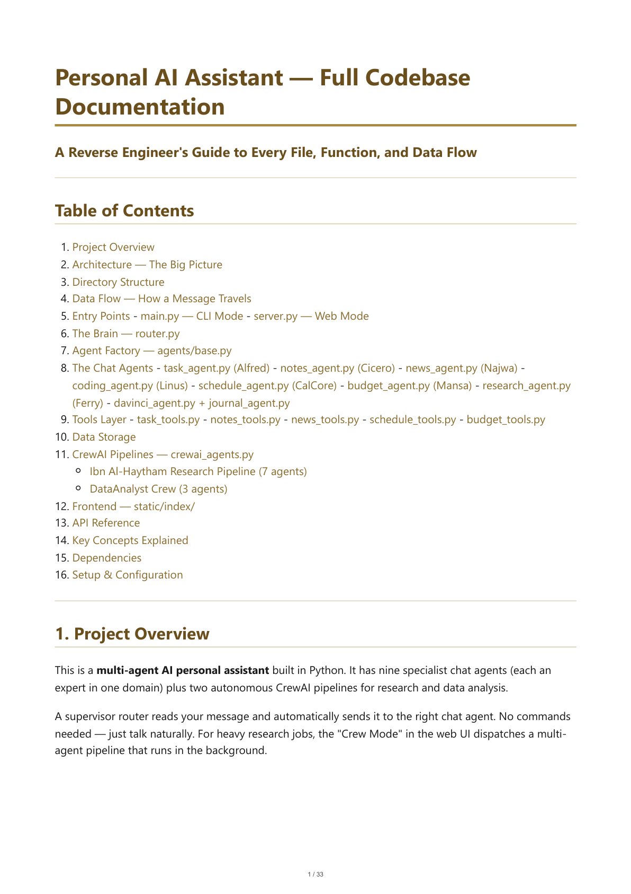
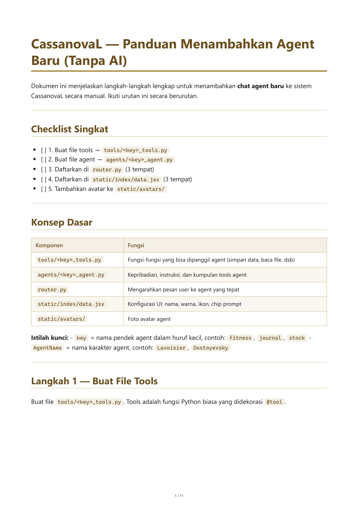

# CassanovaL — Personal AI Multi-Agent Assistant

A web + CLI personal assistant with a roster of specialist AI agents (Mistral AI + LangChain), a supervisor router that auto-dispatches messages to the right agent, and CrewAI background pipelines for research, data analysis, and social scraping. **Mansa** (finance) has a dedicated dashboard at `/finance`.

> 📄 **Documentation renders directly below — no need to download or open the PDF.**

---

## 📘 Full Codebase Documentation

A reverse-engineer's guide to every file, function, and data flow (33 pages).

**[▶ Open the full rendered documentation](DOCUMENTATION.view.md)** · [PDF](DOCUMENTATION.pdf) · [Markdown source](DOCUMENTATION.md)

[](DOCUMENTATION.view.md)

---

## 🛠️ Adding a New Agent — Manual Guide

Step-by-step guide to adding a new chat agent or CrewAI pipeline (11 pages, Bahasa Indonesia).

**[▶ Open the full rendered guide](cassanovaL_instruction.view.md)** · [PDF](cassanovaL_instruction.pdf) · [Markdown source](cassanovaL_instruction.md)

[](cassanovaL_instruction.view.md)

---

## How to Run

```bash
pip install -r requirements.txt
# Web mode (recommended)
$env:PYTHONUTF8=1; python server.py   # http://localhost:8000
# CLI mode (chat agents only)
$env:PYTHONUTF8=1; python main.py
```

See [`CLAUDE.md`](CLAUDE.md) for the full architecture overview.

---

<sub>The rendered pages above are PNG images generated from the PDFs via `scripts/pdf_to_images.py`. Regenerate with: `python scripts/md_to_pdf.py DOCUMENTATION.md cassanovaL_instruction.md && python scripts/pdf_to_images.py DOCUMENTATION.pdf cassanovaL_instruction.pdf`.</sub>
